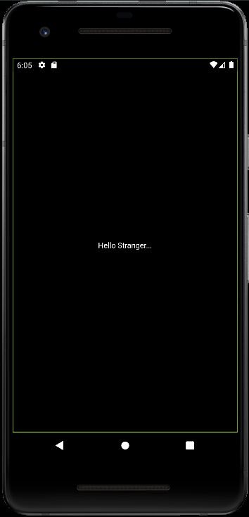

# Primeiro projeto mínimo

## Objetivos de Aprendizado

Ao final deste roteiro você será capaz de criar uma apliação minima em flutter,
e entender os primeiros conceitos da construção de layout dele. 


# Para começar

Vamos começar um projeto novo com a ferramenta de linha de comando do flutter,
com a pasta em nosso **PATH** podemos criar um novo projeto com o comando
asseguir:

---

flutter create AulaWidgetsBasicos

---

Feito isso podemos abrir com o nosso editor de preferência a pasta que foi criada,

Teremos uma estrutura que deve ser algo como abaixo: 

---

<pre>
<span class="mdi mdi-folder"></span> AulaWidgetsBasicos
├── <span class="mdi mdi-file"></span>analysis\_options.yaml
├── <span class="mdi mdi-folder"></span> android
├── <span class="mdi mdi-folder"></span> build
├── <span class="mdi mdi-folder"></span> ios
├── <span class="mdi mdi-folder"></span> lib
├── <span class="mdi mdi-file"></span>pubspec.lock
├── <span class="mdi mdi-file"></span>pubspec.yaml
├── <span class="mdi mdi-file"></span>README.md
├── <span class="mdi mdi-folder"></span> test
├── <span class="mdi mdi-file"></span>testdrive.iml
└── <span class="mdi mdi-folder"></span> web
</pre>

---

Dentro da pasta `lib`, temos um arquivo chamado `main.dart`. 

Abra esse arquivo e apague todo seu conteúdo, pois iremos reescreve-lo aos
poucos para que possamos entender o que está acontecendo.

vamos começar com a primeira linha

{:data-filename="main.dart"}
```dart
import "package:flutter/widgets.dart"
```

Quando utilizamos o `import` no começo de nosso arquivo, estamos falando para o
"complilador" que queremos utilizar o conteúdo desste pacote em nosso código.

Nesse caso estamos indicando que precisamos dos widgets básicos que o flutter
fornece para utilizar em nosso codigo. 

Para isso temos ainda outras duas opções: 

`package:flutter/material.dart`, que irá fornecer widgets bastante comuns que
utlizamos quando estamos fazendo aplicaçÕes android. Material, vem de **Material
Design** que é o padrão de design estabelecido pelo Google. Você pode consutá-lo
no site oficial [material.io](https://material.io/design).

A outra opção que temos é a `packages:flutter/cupertino.dart` em que temos
widgets que seguem os padrões de design definidos pela apple. [Apple
Design](https://developer.apple.com/design/)

Seguindo em nosso código, precisamos agora criar o ponto de entrada de nosso
projeto, mais conhecido como função main. É a partir dela que nosso projeto
começará a ser executado. 


{:data-filename="main.dart"}
```dart
import "package:flutter/widgets.dart"

void main(){
    runApp(/*TODO*/);
}
```

Criamos a função `main`, e ela está apensa chamando a função `runApp`, mas ainda
não terminamos, por isso o `/*TODO*/`, essa função, tem como parâmetro um
Widget, que iremos escrever em breve o nosso. O widget que é passado como
parâmetro para a função `runApp` se torna o Widget raiz de nossa aplicação, e o
Flutter força esse elemento a tomar toda a tela disponível. 


Bom vamos então criar um novo widget para ser a raiz do nosso programa, para
isso é preciso criar uma classe, que herde de algum outro widget, vamos começar
pala `StatelessWidget`, Utilizamos esta classe base quando precisamos criar
elementos que não serão atualizados em "tempo de execução", isso significa que
ele só depende das condiçÕes iniciais para sua construção e não será atualizado,
ou será atualizado muito pouco depois disso. 


{:data-filename="main.dart"}
```dart
import "package:flutter/widgets.dart"

void main(){
    runApp(/*TODO*/);
}

class PrimeiroElementos extends StatelessWidget{

}
```

Com o código acima demos o primeiro passo para construir um widget nosso.
Precisamos agora definir um contrutor para nossa classe, e implementar o metodo
build. 

{:data-filename="main.dart"}
```dart
import "package:flutter/widgets.dart"

void main(){
    runApp(/*TODO*/);
}

class PrimeiroElementos extends StatelessWidget{
    //Construtor
    PrimeiroElemento({Key? key}) : super(key : key);

}
```

Agora definimos o contrutor de nossa classe PrimeiroElemento, vamos rever
algumas coisas dessa linha. 

Temos a seguinte construção `{Key? key}`, essa é a forma que o DART/FLUTTER usa
para a utilização de **parametros nomeados**, neste caso, estamos criando um
parametro de nome key, e que o tipo de Key?, a interrogação indicando que pode
conter um valor nulo. 

Um outro exemplo seria `{String titulo}` nesse caso estamos criando um parâmetro
nomeado titulo, com o tipo String.

Outra parte que precisamos tomar atenção é a `: super(key : key)`. Isso está
chamando o construtor da classe pai, no caso `StatelessWidget`, e passamos por
parâmetro a `key` qye foi recebida como parametro nomeado do nosso contrutor. 

Agora vamos implementar o metodo build.


{:data-filename="main.dart"}
```dart
import "package:flutter/widgets.dart"

void main(){
    runApp(/*TODO*/);
}

class PrimeiroElementos extends StatelessWidget{
    //Construtor
    PrimeiroElemento({Key? key}) : super(key : key);

    @override
    Widget build(BuildContext context){
        return Center();

    }
}
```

Para finalizar trocamos o `/*TODO*/` em `runApp` para o contrutor da classe que
acabamos de criar. 


{:data-filename="main.dart"}
```dart
import "package:flutter/widgets.dart"

void main(){
    runApp(PrimeiroElemento());
}

class PrimeiroElementos extends StatelessWidget{
    //Construtor
    PrimeiroElemento({Key? key}) : super(key : key);

    @override
    Widget build(BuildContext context){
        return Center();

    }
}
```

Agora terminamos de escrever o código mínimo para que possamos criar uma
aplicação minima. 

Vamos disparar um dispositivo virtual pelo Android-Studio ADV Manager, e então, 
podemos tentar executar com o seguinte código em nosso terminal com flutter

--- 

flutter run

--- 

{:.aviso}
Lembre-se que você deve estar na raiz da pasta do seu projeto para esse comando
funcionar.


Se foi feito rudo certo, não teremos erros em nosso terminal: 


E teremos uma LINDA tela preta em nosso emulador.


Não se desespere, está certo, a questão é que nosso widget `PrimeiroElemento`
tem apenas um elemento `Center` que irá centralizar um outro elementos, em seu
centro vertical e horizontal, mas não temos esse outro elemento no momento. 

Vamos adicionar um texto para deixar as coisas *um pouco* mais interessantes:


{:data-filename="main.dart"}
```dart
import "package:flutter/widgets.dart"

void main(){
    runApp(PrimeiroElemento());
}

class PrimeiroElementos extends StatelessWidget{
    //Construtor
    PrimeiroElemento({Key? key}) : super(key : key);

    @override
    Widget build(BuildContext context){
        var texto = Text("Hello stranger....", textDirection: TextDirection.ltr);
        return Center(child: texto);

    }
}
```

Agora inserimos um elemento de texto a nossa aplicação, e o definimos como filho
do Center que estávamos usando antes. 

No terminal que estamos com o flutter run rodando, precione r minusculo, para
atualizar a sua aplicação. 



Na proxima aula, iremos ver com calma os widgets mais básicos do flutter.


