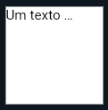
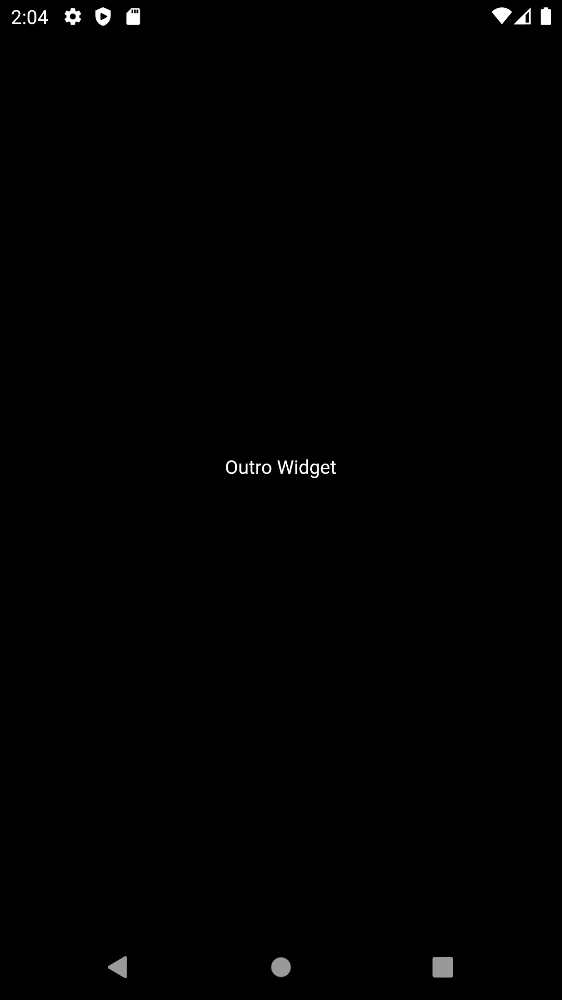
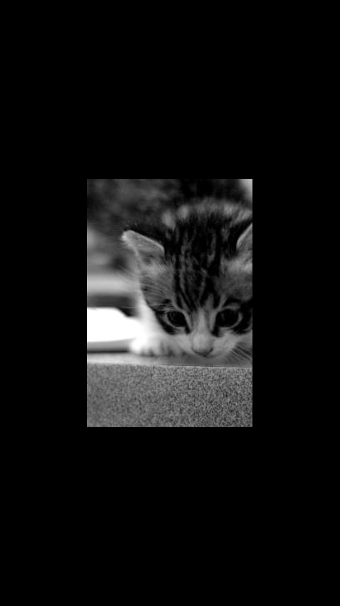
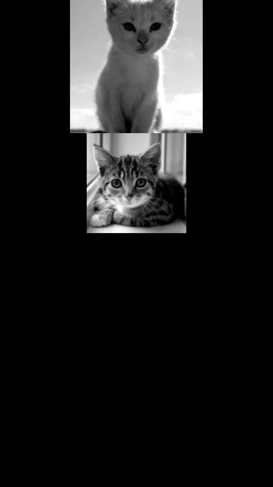
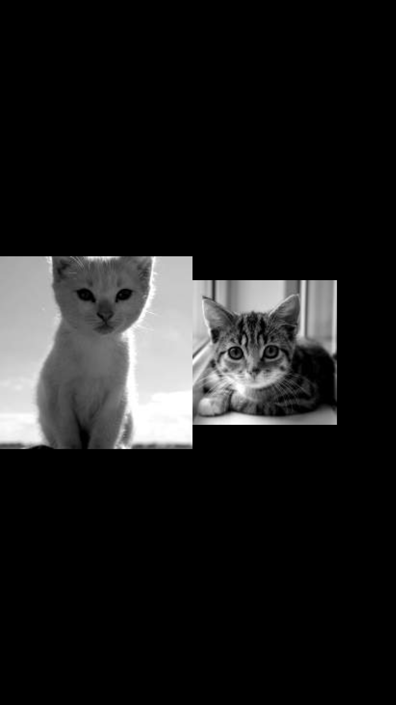
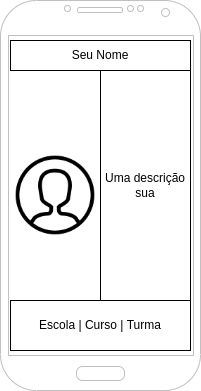

#  Widgets básicos. 

Agora que já sabemos criar nossa clase base para uma aplicação flutter, vamos
ver os elementos básicos que iremos usar muito ao longo de nossa trajetorioa com
o flutter.

## Texto (*Text Widget*)

Claramente será bastante comum apresentarmos texto para o usuário, e para isso
utilizamos este widget. 

```dart
Text("Meu texto", textDirection : TextDirection.ltr);
```

O código acima é a forma mais "crua" de se criar um texto, e o colocando como
filho (child) de um containter ele irá ficar como na imagem


Mas esse elemento tem diversas opções para que possamos deixar as coisas mais
interessantes. 

### Overflow

Utilizamos essa opção quando queremos indicar o que deve acontecer se um texto
for muito grande para seu espaço: 

`TextOverflow.clip`


Essa opção corta o texto que não cabe no seu espaço.


`TextOverflow.elipsis`



Essa opção coloca o sinal de reticências (...) depois da quebra do texto.


`TextOverflow.fade`


Essa opção faz uma transição para o texto ir ficando transparente


`TextOverflow.visible`


Finalmente, esta mantem o texto sendo mostrado mesmo que fora de seu espaço.


```dart
Text("Meu texto", 
     textDirection: TextDirection.ltr,
     overflow: TextOverflow.ellipsis
     );
```

{:.dica}
Percebeu que em algumas oções o texto "quebrou linha" antes de aplicar o
overflow? podemos utilizar a opção `maxLines` para definir um número maximo de
linhas que queremos que isso aconteça.

```dart
Text("Meu texto",
     textDirection: TextDirecrion.ltr,
     overflow: TextOverdlow.ellipsis,
     maxLines: 1
     );
```

### TextAlign

Ess opção cuida de como o texto ficará alinhado horizontalmente

`TextAlign.center` &nbsp; `TextAlign.end` &nbsp; `TextAlign.justify`

`TextAlign.left` &nbsp; `TextAlign.rigt` &nbsp; `TextAlign.start`

```dart
Text("Meu texto",
     textDirection: TextDirecrion.ltr,
     overflow: TextOverdlow.ellipsis,
     maxLines: 1,
     textAlign: TextAlign.center
     );
```

# Center

Este widget é utilizado para centralizar outros componentes, que serão seus
"filhos" (child)

```dart
var OutroWidget = Text("Outro Widget"); //Pode ser QUALQUER outro widget
Center(child: OutroWidget);
```



# Image

Esse elemento mostra uma imagem em seu app, neste momento vamos apenas usar
imagens que estejam carregadas na internet, mas a frente vamos aprender inserir
imagem locais em nossa aplicação. 

```dart
Image.network("https://placekitten.com/g/200/300");
```


# Container

Esse é um dos elementos básicos que começamos a trabalhar com posicionamento,
"pintura" e tamanho. Ele tem um construtor que pode receber diversos parametros
mas vamos começar pelos mais básicos. 

```dart
Container(color: Colors.red);
```

Acima criamos um container apenas com a cor vermelha


Como de prache, podemos colocar um filho nele

```dart
Container(color: Colors.red,
          child: Text("Widget Filho", textDirection:TextDirection.ltr));
```

Podemos também definir altura e largura do nosso container

```dart
Container(color: Colors.red,
          child: Text("Widget Filho", textDirection:TextDirection.ltr)
          width: 50.0,
          height: 100.0);
```


Para verificar o exemplo acima o container não pode ser o elemento raiz da nossa
aplicação!

# Column e Row

Esses widgets organizam diversos filhos dentro da tela, em colunas (column) ou
linhas (row)

```dart
var Widget1 = Text("Widget 1", textDirection: TextDirection.ltr);
var Widget2 = Text("Widget 2", textDirection: TextDirection.ltr);
Column(children: 
        Widget>[
           Widget1,
           Widget2,
        ]);
```

Criamos uma coluna com dois elementos 




```dart
var Widget1 = Text("Widget 1", textDirection: TextDirection.ltr);
var Widget2 = Text("Widget 2", textDirection: TextDirection.ltr);
Row(children: 
        Widget>[
           Widget1,
           Widget2,
        ],
        textDirection: TextDirection.ltr);
```

Criamos uma linha com 2 elementos



# Desafio!

Utilizando os widgets que vimos hoje crie um aplicativo que tenha o seguinte
layout:


