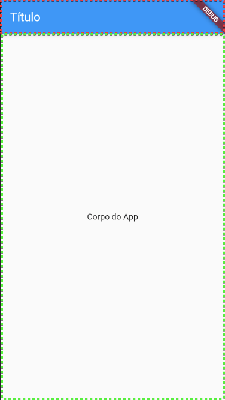
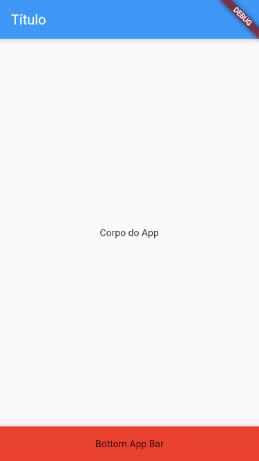
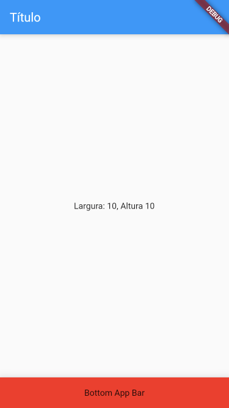
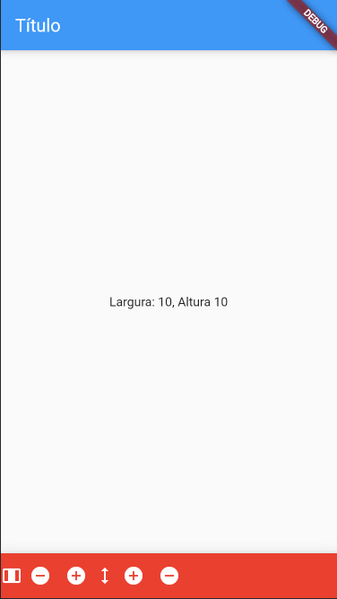

Na ultima aula, vimos com utilizar os widgets MaterialApp e Scaffold:

O primeiro é responsável por carregar as configurações e estilos padrão do
"MaterialApp". 

```dart
  Widget build(BuildContext context) {
    return MaterialApp(
      title: 'Primeiro Stateful',
      home: const MinhaHome(),
    );
  }
```

Ele tem por parâmetros o título, que é uma string `title: 'Primeiro Stateful'`,
e o parâmetro home, que deve ser o Widget principal de nossa aplicação. 

O Scaffold, é um componente que pode ter uma série de elementos, comuns
utilizados em diversos aplicativos. 

O Uso básico dele seria com um Cabeçalho, que é um AppBar, e um "corpo" que é o
body. 

```dart
  @override
  Widget build(BuildContext context) {
    return Scaffold(
      appBar: AppBar(
        title: Text("Título"),
      ),
      body: Center(
        child: Text("Corpo do App"), 
          
      ),
    );
  }
```




Na imagem parte selecionada em vermelho é o Componente AppBar, e a parte em
verde é o Componente body.

Atenção, que o parâmetro appBar do Scafold tem que ser um AppBar ou Algo que
herde de AppBar.


O Scaffold tem ainda uma série de outros parâmetros, que são elementos que
compõem nosso layout, vamos ver mais um que é o BottomNavigationBar


```dart
  @override
  Widget build(BuildContext context) {
    return Scaffold(
      appBar: AppBar(
        title: Text("Título"),
      ),
      body: Center(
        child: Text("Corpo do App"), 
          
      ),
      bottomNavigationBar: BottomAppBar(
        color: Colors.red,
        child: Container(height: 50,
            child:Center(child: Text("Bottom App Bar"))
            )
      )
    );
  }
```




Por enquanto o código completo dessa app ficou assim: 

```dart
import 'package:flutter/material.dart';

void main() {
  runApp(const MyApp());
}

class MyApp extends StatelessWidget {
  const MyApp({Key? key}) : super(key: key);

  @override
  Widget build(BuildContext context) {
    return MaterialApp(
      title: 'Primeiro Stateful',
      home: const MinhaHome(),
    );
  }
}

class MinhaHome extends StatelessWidget{
    const MinhaHome({Key? key}) : super(key: key);

    @override
    Widget build(BuildContext context) {
        return Scaffold(
            appBar: AppBar(
                title: Text("Título"),
            ),
        body: Center(
            child: Text("Corpo do App"), 
        ),
        bottomNavigationBar: BottomAppBar(
            color: Colors.red,
            child: Container(height: 50,
                child: Center(child: Text("Bottom App Bar"))
            )
        ));
    }
}
```

-------

O próximo passo que faremos será adicionar interações para essa aplicação: Para
isso precisamos transformar a Classe MinhaHome em um Stateful Widget, faça a
seguinte alteração:

```dart
class MinhaHome extends StatefulWidget{
```

StateFulll widgets são elementos que podem se redesenhar quando seu estado é
modificado, e definimos estado pelos atributos da classe. 

Para continuar alterando o "MinhaHome" para ser um statefull precisaremos
definir a função `createState()`. 


```dart
class MinhaHome extends StatelessWidget{
    const MinhaHome({Key? key}) : super(key: key);

    @override State<MinhaHome> createState() => _MinhaHomeState();

    //Continua..
```

Estamos usando o construtor `_MinhaHomeState()` mas ainda não definimos essa
classe. Vamos fazer isso agora: 

```dart
class _MinhaHomeState extends State<MinhaHome>{

}
```

O próximo passo, é definir quais são os parâmetros que irão definir nosso
estado: vamos utilizar largura e altura de uma imagem por exemplo: 


```dart
class _MinhaHomeState extends State<MinhaHome>{
    int _largura = 10;
    int _altura  = 10;

}
```

Com o código acima criamos os parâmetros de nosso estado, e definimos que seus
valores iniciais são 10.

Agora, precisamos transferir o método Build que criamos na classe MinhaHome para
a classe \_MinhaHomeState, pode cortar e colar de uma para a outra, seu código
para essas duas classes deverá ficar como abaixo:

```dart
class MinhaHome extends StatelessWidget{
    const MinhaHome({Key? key}) : super(key: key);

    @override State<MinhaHome> createState() => _MinhaHomeState();
}

class _MinhaHomeState extends State<MinhaHome>{
    int _largura = 10;
    int _altura  = 10;

    @override
    Widget build(BuildContext context) {
        return Scaffold(
            appBar: AppBar(
                title: Text("Título"),
            ),
        body: Center(
            child: Text("Corpo do App"), 
        ),
        bottomNavigationBar: BottomAppBar(
            color: Colors.red,
            child: Container(height: 50,
                child: Center(child: Text("Bottom App Bar"))
            )
        ));
    }
}
```

Vamos mudar o o texto do corpo(body) para conseguirmos ver os parâmetros do
nosso estado, faça assim: 

```dart
    //Codigo....
    body: Center(
        child: Text("Largura: $_largura, Altura: $_altura")
    //Codigo....
```

Se tudo estiver certo seu app deve estar assim: 



# Desafio: 
Vamos deixar o body desse app um pouco mais interessante!

Utilize um dos sites abaixo:

- https://placeholder.com
- https://placekitten.com
- http://placebacon.net
- https://placebear.com
- https://place-puppy.com
- https://picsum.photos
- https://www.placecage.com
- https://loremflickr.com


Para inserir uma imagem no corpo do app. 


------------


O próximo passo agora é criar uma forma de interagir com o app, faremos isso
através de botoes, e de ícones.

Para criar um ícone, podemos usar o widget Icon

```dart
Icon(
    Icons.home,
    color: Colors.white
    )
```

E para criar um Botão com icone utilizamos o Icon Button, 

```dart
IconButton(
    icon: Icons.home,
    color: Colors.white,
    onPressed: (){},
    )
```

Perceba que o IconButton tem o parâmetro onPressed, é nele que iremos colocar a
funcionalidade que queremos quando clicarmos neste botão.

Vamos colocar os botões e ícones no BottomAppBar

```dart
    //Codigo...
        bottomNavigationBar: BottomAppBar(
            color: Colors.red,
            child: Container(height: 50,
                child: Row( 
                    children: <Widget>[
                    Icon(Icons.width_normal, color:Colors.white),
                    IconButton(
                        icon: Icon(Icons.add_circle),
                        color: Colors.white,
                        onPressed: (){}
                    ),
                    IconButton(
                        icon: Icon(Icons.remove_circle),
                        color: Colors.white,
                        onPressed: (){}
                    ),
                    Icon(Icons.height_outlined, color:Colors.white),
                    IconButton(
                        icon: Icon(Icons.add_circle),
                        color: Colors.white,
                        onPressed: (){}
                    ),
                    IconButton(
                        icon: Icon(Icons.remove_circle),
                        color: Colors.white,
                        onPressed: (){}
                    )
                ]
                )
            )
    //Codigo
```

Se tudo tiver dado certo o app ficará mais ou menos assim: 



Vamos fazer os botões funcionar agora, crie as funções AumentarLargura,
DiminuirLargura, AumentarAltura e diminuirAltura

```dart
class _MinhaHomeState extends State<MinhaHome>{
    int _largura = 10;
    int _altura  = 10;

    void AumentarLargura(){
    }

    void DiminuirLargura(){
    }

    void AumentarAltura(){
    }

    void DiminuirAltura(){
    }
```

Vou mostrar como deve ficar o AumentarLargura, e os outros são semelhantes, para
que nosso aplicativo seja redesenhado precisamos chamar a função setState, veja
como irá ficar:


```dart

    void AumentarLargura(){
        setState( () {
            _largura += 10;
        });
    }
```

E para que o botão dele funcione, precisamos atribuir essa função no parâmetro
onPressed dos botões veja:

```dart
IconButton(
    icon: Icon(Icons.add_circle),
    color: Colors.white,
    onPressed: AumentarLargura,
),
```

O código completo com só o primeiro botão funcionando ficará assim:


```dart
import 'package:flutter/material.dart';

void main() {
  runApp(const MyApp());
}

class MyApp extends StatelessWidget {
  const MyApp({Key? key}) : super(key: key);

  @override
  Widget build(BuildContext context) {
    return MaterialApp(
      title: 'Primeiro Statefull',
      home: MinhaHome(),
    );
  }
}

class MinhaHome extends StatefulWidget{
    const MinhaHome({Key? key}) : super(key: key);

    @override State<MinhaHome> createState() => _MinhaHomeState();
}

class _MinhaHomeState extends State<MinhaHome>{
    int _largura = 10;
    int _altura  = 10;

    void AumentarLargura(){
        setState( () {
            _largura += 10;
        });
    }

    void DiminuirLargura(){
    }

    void AumentarAltura(){
    }

    void DiminuirAltura(){
    }

    @override
    Widget build(BuildContext context) {
        return Scaffold(
            appBar: AppBar(
                title: Text("Título"),
            ),
        body: Center(
            child: Text("Largura: $_largura, Altura $_altura"), 
        ),
        bottomNavigationBar: BottomAppBar(
            color: Colors.red,
            child: Container(height: 50,
                child: Row( 
                    children: <Widget>[
                    Icon(Icons.width_normal, color:Colors.white),
                    IconButton(
                        icon: Icon(Icons.add_circle),
                        color: Colors.white,
                        onPressed: AumentarLargura
                    ),
                    IconButton(
                        icon: Icon(Icons.remove_circle),
                        color: Colors.white,
                        onPressed: (){}
                    ),
                    Icon(Icons.height_outlined, color:Colors.white),
                    IconButton(
                        icon: Icon(Icons.add_circle),
                        color: Colors.white,
                        onPressed: (){}
                    ),
                    IconButton(
                        icon: Icon(Icons.remove_circle),
                        color: Colors.white,
                        onPressed: (){}
                    )
                ]
                )
            )
        ));
    }
}
```
