# Instalação do Flutter

## Objetivos de Aprendizado

Ao final deste roteiro você será capaz de configurar seu ambiente de trabalho
para acompanhar as aulas, e desenvolver suas aplicações. 

# Instalação 

Para começar a instalação acesse o site de instalação do flutter
[aqui](https://docs.flutter.dev/get-started/install)

E selecione o sistema operacional correspondente ao seu ambiente. -- Vamos
seguir com a instalação no Windows --

Faça o download do **_SDK_** -- no momento da execução desse roteiro é a versão 2.10.4

Feito isso, crie uma pasta na raiz do disco, ou em qualquer lugar que achar
melhor, uma pasta que deverá conter o SDK do flutter. 


---

C:\fluter-sdk

---


Criada essa pasta podemos extrair o arquivo que baixamos para ela. 

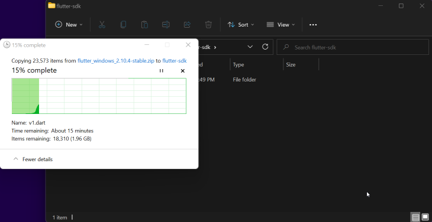


Feito isso precisamos adicionar a pasta de binários a nossa variável de
ambiente. Para isso execute o seguinte código no cmd:

---

set PATH=%PATH%;C:\pasta\do\seu\flutter\bin

---

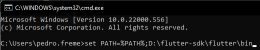

{: .aviso}
Esse comando fará essa alteração apenas temporariamente. Fazer essa alteração
definitivamente siga as instruções [neste arquivo](AlterandoOPath.md)

- [ ] Salve no seu repositório uma captura de tela do terminal depois de 
executado o comando.

Feito isso podemos rodar o `flutter doctor` que fará algumas verificações em
nosso ambiente para saber se está tudo certo para começarmos o desenvolvimento.

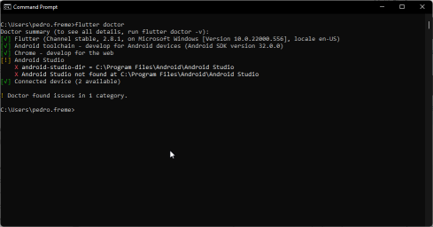

- [ ] Rode o comando flutter doctor e salve em seu repositório  uma captura do terminal depois de
executado. 

Vamos corrigir agora cada um dos problemas indicados pelo `flutter doctor`

----


## Dev. Android.

Por mais que possamos utilizar qualquer editor para escrever aplicações flutter,
precisamos de uma instalação completa do Android Studio para que o flutter
funcione corretamente.

1. Baixe e faça a instalação do Android Studio. 

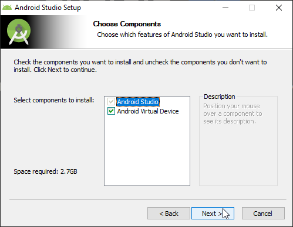

2. Execute o android studio uma primeira vez para que seja feita a configuração
   necessária, **Android SDK, Android SDK Command-line Tools, e Android SDK
   Build-Tools**

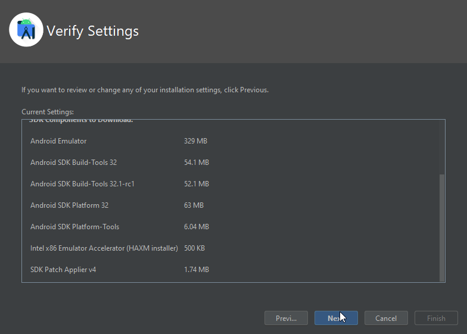

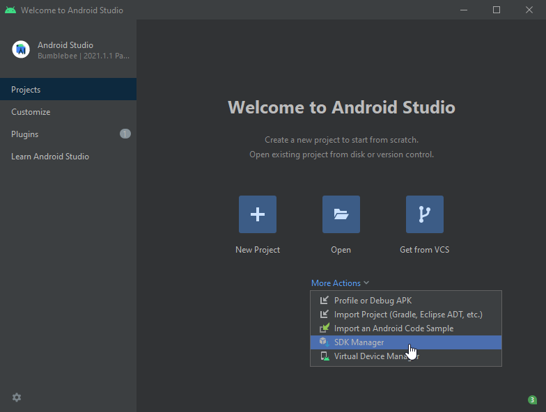

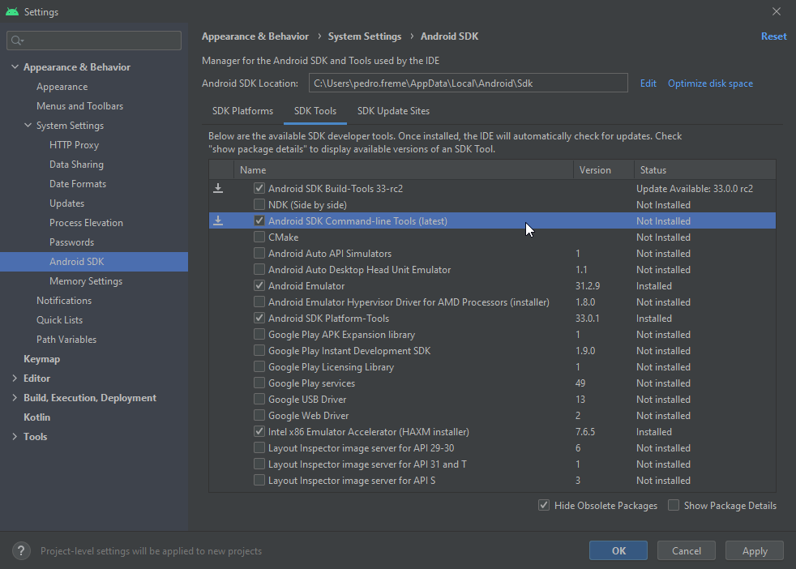

   
3. Execute novamente o `flutter doctor`para verificar se tudo foi feito de
   maneira correta.


Agora precisamos configurar um emulador para trabalhar com o flutter. No android
studio procure pelo **Android Virtual Device Manager** e com ele aberto
selecione, **Create Virtual Device**. E siga as imagens abaixo:


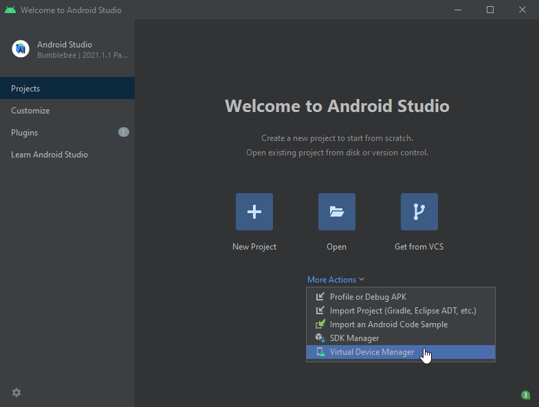
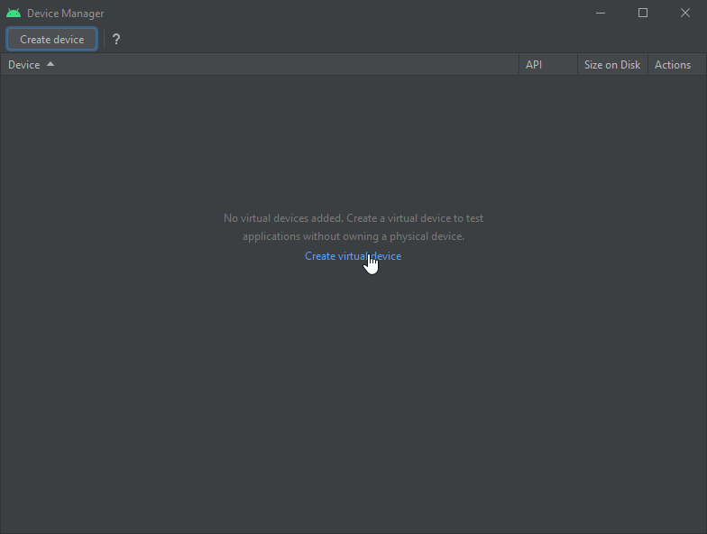
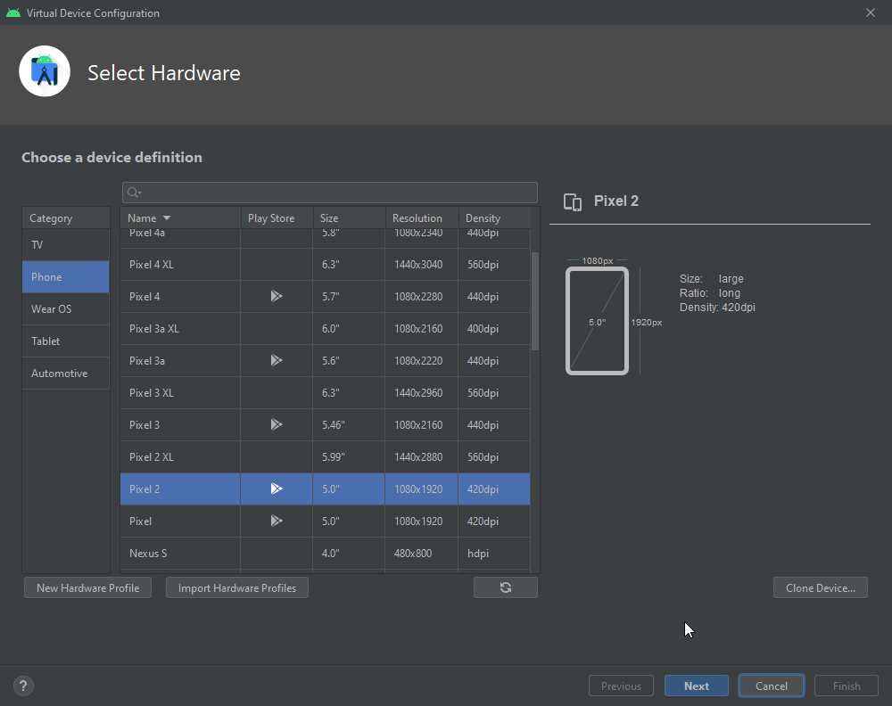
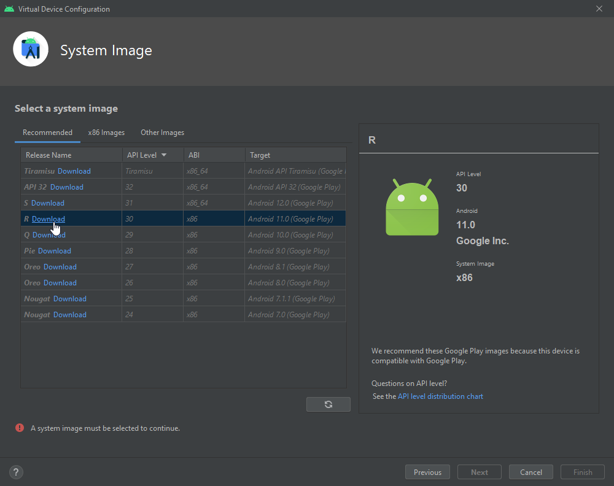
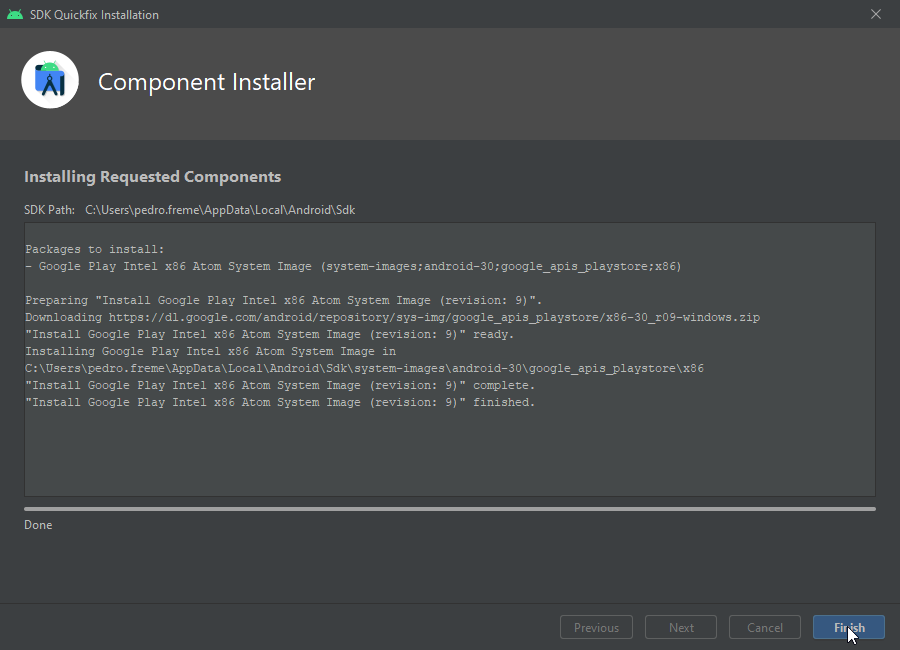
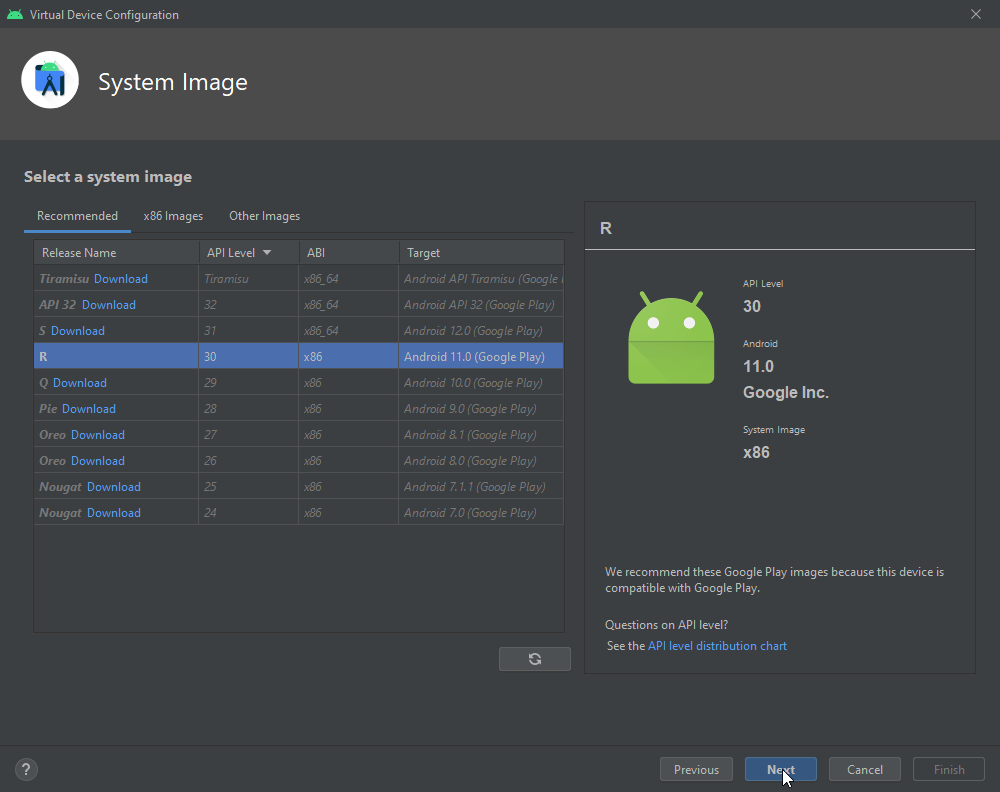
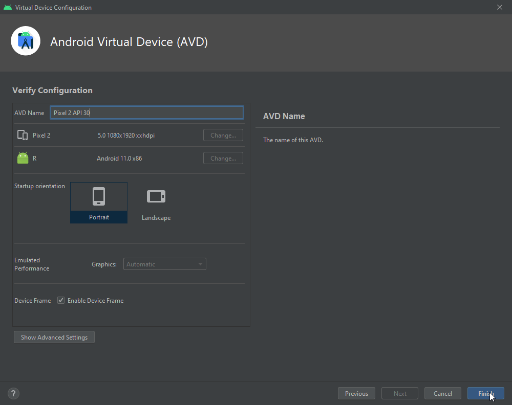
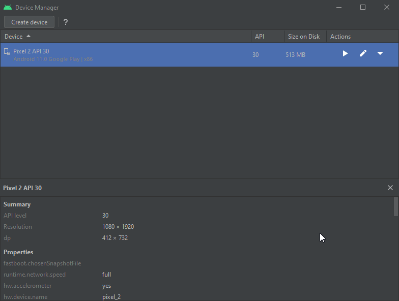

Execute o dispositivo que você acabou de criar, um dispositivo android deve
abrir na home padrão.


Por fim precisamos aceitar algumas licenças, execute então o comando:

```cmd
flutter doctor --android-licenses
```

Revise os termos e os aceite.

Por fim execute o `flutter doctor` novamente para verificarmos que está tudo
pronto para começarmos o desenvolvimento. 


