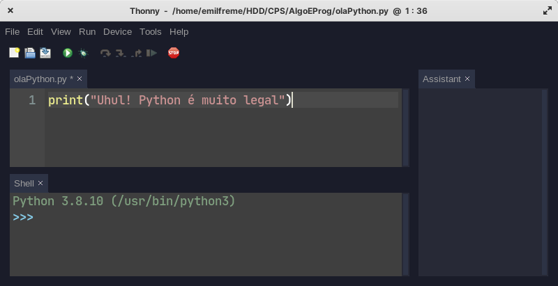
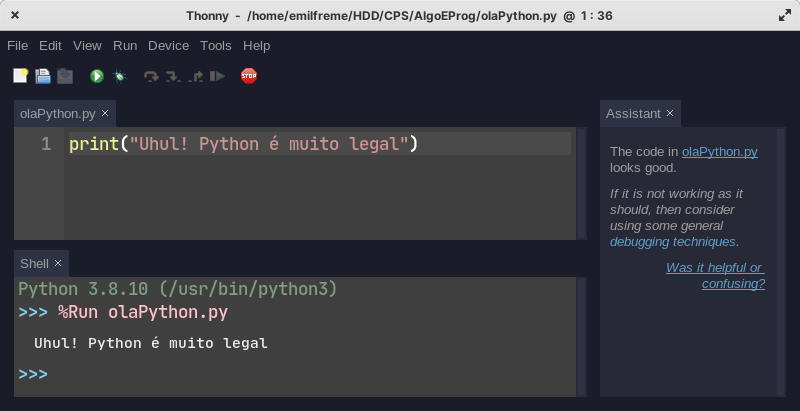
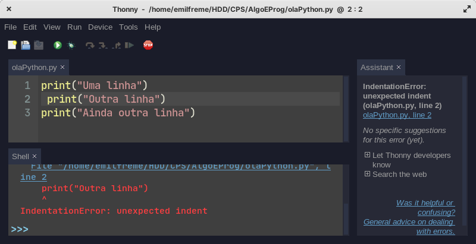

# Meu primeiro script Python 

Agora que estamos com o Python configurado, vamos criar o nosso primeiro
primeiro programa. 

Abra o Thonny -- Ou seu editor de texto favorito -- e coloque o seguinte código:
 

```python
print("Uhul! Python é muito legal")
```

Feito isso salve o arquivo como `olaPython.py`



Agora clique no simbolo de "Tocar/Play" no editor. Se tudo deu certo teremos
algo como na imagem:




{:.dica}
Se você gosta de atalhos, podemos utilizar a tecla F5 no teclado para executar
nosso programa também. No Visual Studio Code também funciona.

## Mas o que aconteceu?

Quando pedimos para o Thonny "rodar" nosso script, na verdade estamos pedindo
para que o **Interpretador** Python executa `linha a linha` o que está escrito
em nosso código. No caso é apenas o comando `print` que irá "Imprimir no
terminal" o que quer que tenhamos passado dentro dos parenteses dela.

Temos que tomar MUITO cuidado quando estamos escrevendo nossos códigos em python
pois os espaços em branco tem significado!!! Veja:

```python
print("Uma Linha")
 print("Outra Linha")
print("Ainda outra linha")
```
O Código acima dará erro, pois a segunda linha tem um espaço vazio antes do
comando.



Esses espaços que tem significado,chamamos de `indentação`, e no caso do erro
acima é exatamente um Erro de indentação (IndentationError). 

Um pouco mais pra frente no curso iremos retomar esse conceito, mas por enquanto
lembre-se de não deixar nenhum espaço no começo de sua linha de código.


# Interpretador

Na parte de baixo do Thonny, onde está escrito shell, temos rodando o Interpretador, e com ele podemos
executar alguns comandos para serem executados instantâneamente. 

Tente por exemplo fazer algumas operações matemáticas.


Podemos utlizar o intepretador para diversas coisas, e ao longo do curso vamos
o conhecendo um pouquinho melhor. 

# Operadores Matemáticos

Acabamos de ver na sessão anterior que podemos fazer operações matemáticas
e o intepretador do Python nos dará as respostas. Assim podemos fazer todas as
operações matemáticas básicas.

`adição`, que utilizamos o o sinal de mais (+):

```python
42 + 68
```

`subtração`, que utilizamos o sinal de menos (-):

```python
50 - 25
```

`multiplicação`, que utilizamos o sinal de asterisco (\*):

```python
10 * 30
```

`divisão`, que utilizamos o sinal de barra (/)

```python
100 / 50
```

Temos ainda um operador que será bastante utilizado que é o operador de `resto da
divisão inteira`, representado pelo sinal de porcentagem (%).

Na imagem, a caixa azul é o resto.


```python
14 % 5
```


