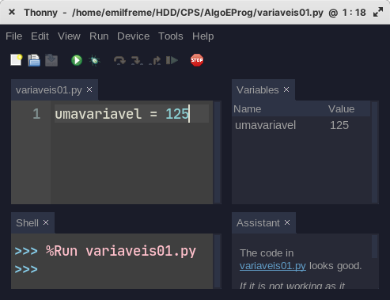
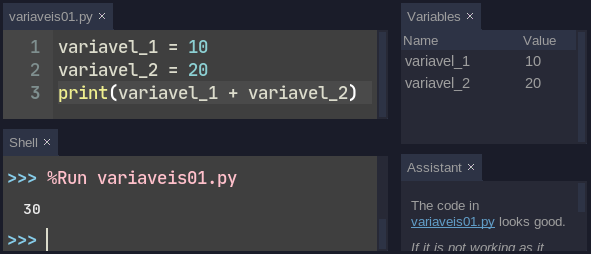

# Variáveis 

Na aula anterior, vimos como fazer contas no interpretador do Python, mas todas
as contas que fizemos foram perdidas, isso é, não conseguimos reutilizar os
resultados para outras contas por exemplo. 

Para salvar informações que utilizaremos ao longo de nossos programas precisamos
criar variáveis, e Pythons nos permite fazer isso de uma maneira bastante
simples. 

O primeiro passo é definir um nome para nossa variável, e esse nome deverá
seguir algumas regrinhas. 

- Uma variável deve começar com letras ou \_;
- Uma variável **NÃO** pode começar com números;
- Uma variável **NÃO** pode conter "caracteres especiais" (ç, á, ã...) 

Por fim variáveis são diferênciadas por suas letras maiusculas e minusculas
(case-sensitive), isso significa que se no nosso código encontrarmos uma
variavel `minhavariavel` e mais a frente `MinhaVariavel` para o python são duas
coisas diferentes. Lembre-se disso!

Depois de definido o nome de nossa variável, podemos definir o que será salvo
nela. Para isso utilizamos o sinal de igual (=)  e o valor que queremos salvar.

```python
umavariavel = 125
```

No caso do código acima, estamos criando uma variável chamada `umavariavel` e
que está guardando o valor 125. No Thonny, para acompanhar isso podemos abrir a
janela de variáveis em `View > Variables`



As variáveis, tem diverssos **tipos** possíveis, agora vamos olhar para os tipos
mais simples que iremos encontar ao longo de nossos programas:

`Numeros inteiros` são utilizados para contagens, podem ser positivos ou negativos. Em programação é o tipo `int`

```python
idade = 10

pontos = 150

alunos = 35

dias = 31
```

`Numeros decimais` são utilizados quando precisamos da parte depois da virgula
dos números, contas com divisão e notas por exemplo. Temos apenas que lembrar
que na programação o divisor decimal é o ponto e não a virgula!! Esse tipo é
conhecido por `float`

```python
pi = 3.1415

notaAula = 9.75

taxa = 7.5

presenca = 0.55
```

`boleanos` são variaveis especiais que guardam apenas valores de Verdadeiro
`True` e Falso `False`, esse é o `bool`. Atenção na forma como True e False são
escritos com as primeiras letras maiusculas

```python
estachovendo = False

maiordeidade = True

ganhou = False
```

Por fim, mas não menos importante temos o tipo de veriavel que guarda texto. Que
é conhecido como `string`

```python
boasvindas = "Olá! Tudo bem?"

avisorecebido = "Uma mensagem foi recebida" 

nome = "Maria Maria"
```


Agora que já sabemos criar variáveis, podemos utilizá-las, para isso basta
colocar o nome dela onde queremos seu valor. Por exemplo somar duas variaveis


