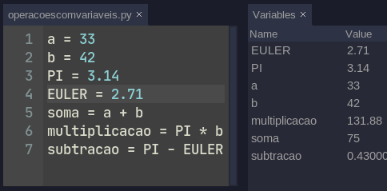
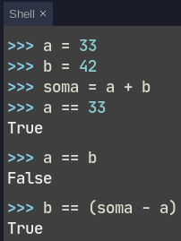
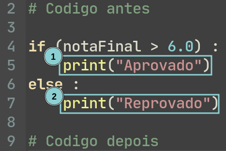

# Na ultima aula...

Acabamos de ver como criar variáveis no python, e juntando com os Operadores
Matemáticos, conseguimos fazer algumas contas e salvar essas contas nas mesmas
variáveis ou outras variáveis. 



# Operadores de comparação. 

Uma outra ação bastante comum que faremos em nossa jornada será a de comparação
entre diversos "objetos" que encontraremos ao longo de nossos códigos, e para
isso utilizaremos os operadores de comparação. 

Quando usamos esses operadores, nos será devolvida a informação se aquela
expressão é verdadeira(True) ou falsa(False)

O primeiro que veremos é o comparador de igualdade. Mas pense no que você
aprendeu até agora! 

O que o código abaixo faz?

```python
variavel1 = 300
```

Se você respondeu alguma coisa no formado de: Define variável como 300, Atribui
300 para a variável ou salva 300 na memória da variável, parabéns! Você está
prestando atenção!

Mas... Se utilizamos o sinal de igual para atribuição, como que é o operador de
igualdade? &#129300;

Para isso, dobramos o sinal de igual, e o operador de igualdade então fica `==`



Temos diversos outros operadores de comparação, para diferentes situações que
precisaremos enfrentar. 

| Nome | Operador | 
| :--- | -------: |
| Igual a | `==` | 
| Maior que | `>` | 
| Maior ou igual a | `>=` | 
| Menor que | `<` | 
| Menor ou igual a | `<=` | 
| Diferente de | `!=` |  

# Condicionais <small>if..else</small>.

Agora que aprendemos a fazer comparações, podemos utilizá-las para tomar
decisões em nosso código. 

Para isso utilizaremos os operadores de comparação em conjunto com as estruturas
condicionais. 

Antes de ver em código, vamos pensar em um exemplo, imagine que para que um
aluno seja aprovado em uma matéria, ele precisa de uma nota acima de 6.0.
Podemos refrasear isso da seguinte forma:

> Se a nota final do aluno for maior que 6.0 ele estará aprovado, caso contrário
> ele estará reprovado. 

Se salvarmos a nota do aluno em uma variável `notaFinal` por exemplo podemos,
utilizando o que acabamos de aprender reescrever assim:

> Se notaFinal > 6.0 aluno aprovado,
> 
> caso contrário, reprovado


Na programação temos uma estrutura que nos permite fazer essas decisões que é o
if..else, veja como ficaria em um código o exemplo:

```python 
if (notaFinal > 6.0) :
    print("Aprovado")
else:
    print("Reprovado")
```

A forma genérica do if..else fica assim: 

```python
if (condicao) :
    # Código se condicao for verdadeira
else : 
    # Código se condicao for falsa
```
`condicao` no código acima, SEMPRE vai ser uma expressão que retorne
verdadeiro(True) ou falso(False), como nas expressões com os operadores de
comparação que acabamos de ver. 

A segunda parte, depois do `else` é opcional e nem sempre iremos utilizá-la. 

Para melhor entender o funcionamento da ramificação de código, precisamos pensar
em "blocos de código"



No exemplo acima temos, o programa principal, o bloco `1` e o bloco `2`. --
Lembra que no pythons os espaços em branco no começo da linha tem significado? 
Chamamos isso de indentação, e eles definem esses blocos.

Como que o computador executa esse código?

Ele irá intepretar a linha 4, se a variavel notaFinal for maior que 6.0 então
`notaFinal > 6.0`, será verdadeiro(True), então será executado o bloco `1`.

Mas, se notaFinal, não for maior que 6.0, então `notaFinal > 6.0` será
falso(False), e então a execução irá pular para a linha 6. Como é uma expressão
else, então será execudado o código do bloco `2`, e depois seguindo o script


### Mais Exemplos:


{:data-filename="Bom dia ou boa noite"}
```python
if (horaDoDia < 18):
    print("Bom Dia")
else:
    print("Boa Noite")
```


{:data-filename="Checa numero par"}
```python
if(numero % 2): #Lembra como resto da função funciona?
    print("Numero par")
else: 
    print("Numero impar")
```


## if..elif..else

Muita vezes, apenas uma condição não é suficiente, a precisamos verificar
diversas condições, para casos diferentes. 

Vamos pensar em um restaurante que sirva o café da manhâ, almoço, e janta, e
tenha cardápios diferentes, podemos fazer o seguinte código:

```python
if (horaDoDia < 11) :
    print("Cardápio café")

elif (horaDoDia < 16) :
    print("Cardápio almoço")

else:
    print("Cardápio jantar")
```

"Traduzido" esse código para portugues: 
> se a horaDoDia for menor que 11 horas, será cardápio de café da manha, 
>
> mas se a hora do dia for maior que 11 horas, e menor que 16 horas, o cardápio
> será de almoço, 
>
> e por fim, se a hora do dia for maior que 16 horas, o cardápio será de jantar.

o uso do elif é bastante parecido com o do if, com a diferença que ele
"encadeia" as verificações.

E se a primeira condição for verdadeira as outras nem são testadas. 

