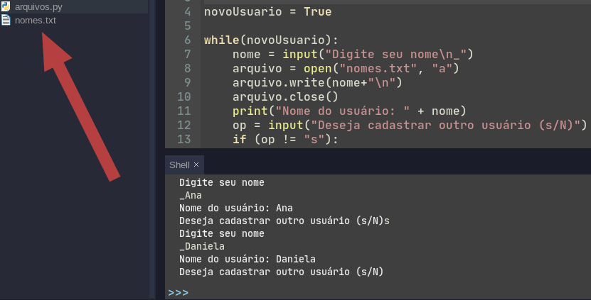
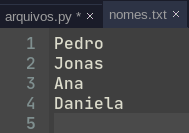
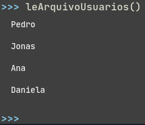

Até agora, todos os nossos programas foram efêmeros, ou seja, não conseguiamos
salvar dados em disco ou mesmo carregar esses dados, vamos fazer isso nesta
aula.

# Arquivo txt

Esse é o jeito mais simples de se salvar um arquivo, para isso utilizaremos duas
funções nativas do python, o `open` para abrir os arquivos e o `close` para
fechar os arquivo.

Como exemplo vamos fazer um cadastro simples de usuários.

A parte que já conhecemos: 

```python
novoUsuario = True

while(novoUsuario) :
    nome = input("Digite seu nome\n_")
    print("Nome do usuário: " + nome)
    op = input("Deseja cadastrar outro usuário (s/N)
    if (op != "s"):
        novoUsuario = False
```

Qual que é o problema com esse código? Ué, simples, toda vez que inserimos um
novo nome de usuário, estamos trocando o conteúdo da variável nome, e o que
estava lá antes, é perdido. 


Para salvar em arquivo isso, vamos adicionar só mais algumas linhas em nosso
código. 

```python
novoUsuario = True

while(novoUsuario) :
    nome = input("Digite seu nome\n_")
    arquivo = open("nomes.txt", "a")
    arquivo.write(nome + "\n")
    arquivo.close()
    print("Nome do usuário: " + nome)
    op = input("Deseja cadastrar outro usuário (s/N)
    if (op != "s"):
        novoUsuario = False
```

No codigo acima estamos abrindo um arquivo `nomes.txt`, no mode de adição de
dados `a`, escrevemos o nome do usuárop que acabamos de cadastrar com o
`arquivo.write(nome + "\n")`, e por fim fechamos o arquivo com o
`arquivo.close`. É de extrema importância que fechemos o arquivo, logo depois da
operação que fizermos com ele.

Depois de executarmos o código acima e inserir alguns usuários, abra o arquivo
nomes.txt que foi criado no mesmo lugar que o script estiver.





E utilizando o modo de adição (a) no open, toda vez que rodarmos esse código
adicionaremos mais uma linha de usuário ao arquivo. 

Vamos "encapsular" esse script em uma chamada de função.

```python
def cadastraUsuario():
    novoUsuario = True
    
    while(novoUsuario):
        nome = input("Digite seu nome\n_")
        arquivo = open("nomes.txt", "a")
        arquivo.write(nome+"\n")
        arquivo.close()
        print("Nome do usuário: " + nome)
        op = input("Deseja cadastrar outro usuário (s/N)")
        if (op != "s"):
            novoUsuario = False
```

e vamos criar uma nova função agora para ler esse aquivo, e imprimir todos os
nomes cadastrados.

```python
def leArquivoUsuarios():
    arquivo = open("nomes.txt", "r")
    listaDeNomes = arquivo.readlines()
    arquivo.close()

    for nome in listaDeNomes:
        print(nome)
```

Nesse código acima temos que abrir o arquivo em modo leitura(read - r),
utilizamos o comando `readlines()` que irá nos retornar uma lista com cada uma
das linhas do nosso arquivo.

E opa! Tem uma estrutura nova que ainda não tinhamos visto!!!

```python
for nome in listaDeNomes:
    print(nome)
```
Essa é a instrução for-each do python, em portugues lemos como para cada, então o
código acima leriamos: 

> Para cada nome na lista de nomes, imprima o nome

E ele ira executar o código de seu bloco para cada um dos elementos de uma
lista.

Veja como ficou a saida do nosso programa, quando chamamos a função
`leArquivosUsuarios()`





